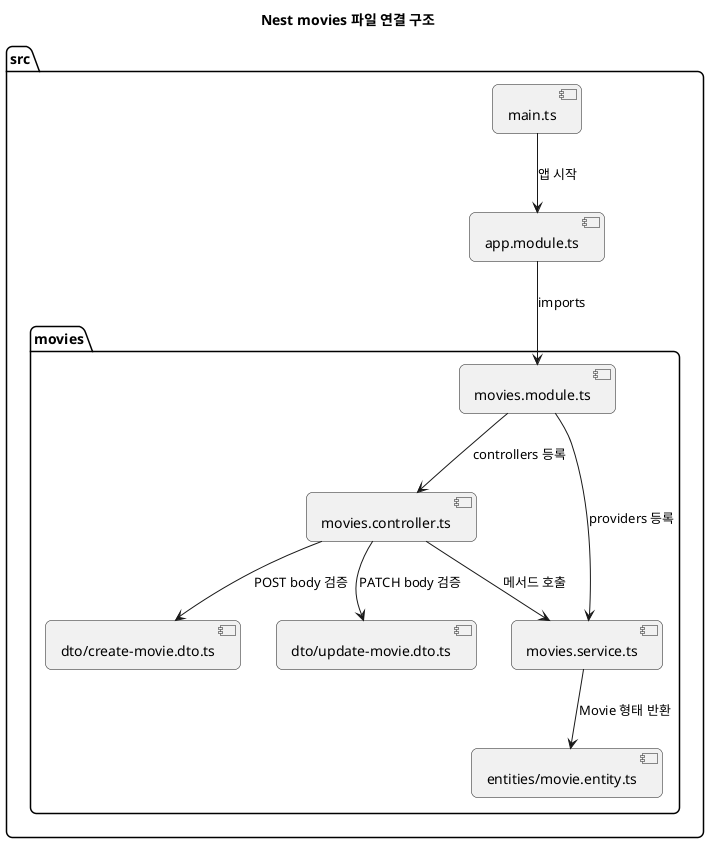
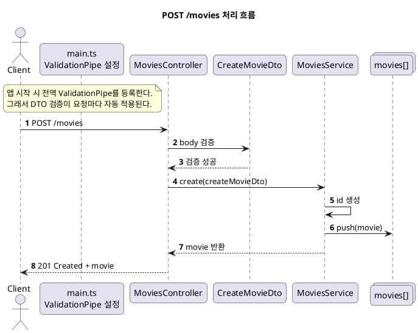

# Nest `movies` 코드 구조 설명

이 문서는 `nest/src/movies`에 추가한 코드가 파일별로 무슨 역할을 하는지 한눈에 보이게 정리한 문서다.  
설명 대상은 아래 파일들이다.

- `nest/package.json`
- `nest/src/main.ts`
- `nest/src/app.module.ts`
- `nest/src/movies/movies.module.ts`
- `nest/src/movies/movies.controller.ts`
- `nest/src/movies/movies.service.ts`
- `nest/src/movies/dto/create-movie.dto.ts`
- `nest/src/movies/dto/update-movie.dto.ts`
- `nest/src/movies/entities/movie.entity.ts`

## 먼저 큰 흐름만 보기

`main.ts`에서 앱을 시작하고 전역 검증을 켠다.  
`app.module.ts`에서 `MoviesModule`을 앱에 등록한다.  
`movies.module.ts`에서 `MoviesController`, `MoviesService`를 묶는다.  
`movies.controller.ts`가 HTTP 요청을 받고, `movies.service.ts`가 실제 CRUD 로직을 처리한다.  
`DTO`는 요청값을 검사하고, `Movie` 엔티티는 데이터 모양을 정리한다.

## 폴더 구조

```text
nest/
  src/
    main.ts
    app.module.ts
    movies/
      movies.module.ts
      movies.controller.ts
      movies.service.ts
      dto/
        create-movie.dto.ts
        update-movie.dto.ts
      entities/
        movie.entity.ts
```

## PUML 1. 파일 연결 구조



## PUML 2. `POST /movies` 처리 흐름



## 파일별 설명

### 1. `nest/package.json`

역할은 DTO 검증에 필요한 라이브러리를 추가하는 것이다.

- `class-validator`
  DTO 필드에 검증 규칙을 붙일 때 쓴다.
- `class-transformer`
  문자열로 들어온 값을 숫자 타입으로 바꾸는 데 쓴다.

이번 `movies` 예제에서는 `year`를 숫자로 처리하고, `title`, `genres`를 검증하기 위해 필요하다.

### 2. `nest/src/main.ts`

이 파일은 앱의 시작점이다.

하는 일은 3가지다.

- `AppModule`을 기준으로 Nest 앱 생성
- `ValidationPipe` 전역 등록
- 서버 실행

핵심은 `ValidationPipe`다.  
이 설정이 있어야 `CreateMovieDto`, `UpdateMovieDto`에 적은 검증 규칙이 실제 요청에서 동작한다.

현재 옵션 의미는 아래와 같다.

- `transform: true`
  DTO 타입 기준으로 값 변환을 시도한다.
- `whitelist: true`
  DTO에 없는 필드는 제거한다.
- `forbidNonWhitelisted: true`
  DTO에 없는 필드가 들어오면 에러를 낸다.

즉, `main.ts`는 "검증을 켜는 곳"이라고 보면 된다.

### 3. `nest/src/app.module.ts`

이 파일은 앱의 루트 모듈이다.

여기서는 `MoviesModule`을 `imports`에 등록했다.  
의미는 "`movies` 기능을 앱 전체에 연결한다"는 것이다.

이 파일이 없으면 `movies.controller.ts`와 `movies.service.ts`를 만들어도 Nest가 그 기능을 모른다.

즉, `app.module.ts`는 "기능을 앱에 꽂는 곳"이다.

### 4. `nest/src/movies/movies.module.ts`

이 파일은 `movies` 기능 전용 모듈이다.

하는 일은 아래 두 개다.

- `MoviesController` 등록
- `MoviesService` 등록

Nest에서는 보통 기능 단위로 모듈을 하나 만든다.  
그래서 `movies`와 관련된 부품들을 여기서 한 묶음으로 관리한다.

즉, `movies.module.ts`는 "movies 기능 묶음"이다.

### 5. `nest/src/movies/entities/movie.entity.ts`

이 파일은 `Movie` 데이터가 어떤 모양인지 정의한다.

필드는 아래와 같다.

- `id: number`
- `title: string`
- `year: number`
- `genres: string[]`

지금 단계에서는 ORM 엔티티라기보다 "영화 객체의 타입 정의"에 가깝다.  
서비스가 반환하는 데이터 모양을 명확하게 해 주는 역할이다.

즉, `movie.entity.ts`는 "Movie 객체 설계도"다.

### 6. `nest/src/movies/dto/create-movie.dto.ts`

이 파일은 `POST /movies` 요청 바디를 검증한다.

검사 규칙은 아래와 같다.

- `title`
  문자열이어야 하고 비어 있으면 안 된다.
- `year`
  숫자여야 하고 정수여야 하며 `1888` 이상이어야 한다.
- `genres`
  배열이어야 하고 최소 1개 이상이어야 하며 각 원소는 문자열이어야 한다.

즉, "영화를 새로 만들 때 어떤 입력만 허용할지"를 정의한 파일이다.

예를 들어 아래 요청은 통과한다.

```json
{
  "title": "Inception",
  "year": 2010,
  "genres": ["SF", "Thriller"]
}
```

반대로 아래 요청은 실패한다.

```json
{
  "title": "",
  "year": "abc",
  "genres": []
}
```

### 7. `nest/src/movies/dto/update-movie.dto.ts`

이 파일은 `PATCH /movies/:id` 요청 바디를 검증한다.

생성과 가장 큰 차이는 모든 필드가 선택값이라는 점이다.  
수정은 일부 필드만 보내도 되기 때문에 `@IsOptional()`을 붙였다.

예를 들면 아래처럼 일부만 보내도 된다.

```json
{
  "title": "Interstellar"
}
```

즉, `update-movie.dto.ts`는 "수정할 때 들어온 값만 검사하는 파일"이다.

### 8. `nest/src/movies/movies.controller.ts`

이 파일은 HTTP 요청을 직접 받는 곳이다.

`@Controller('movies')`가 있기 때문에 기본 경로는 `/movies`가 된다.  
메서드별 역할은 아래와 같다.

- `@Post()`
  `POST /movies`
- `@Get()`
  `GET /movies`
- `@Get(':id')`
  `GET /movies/:id`
- `@Patch(':id')`
  `PATCH /movies/:id`
- `@Delete(':id')`
  `DELETE /movies/:id`

컨트롤러의 핵심 책임은 아래 3가지다.

- 어떤 URL을 받을지 정한다.
- 요청 바디와 파라미터를 받는다.
- 서비스 메서드를 호출한다.

여기서 중요한 부분은 `ParseIntPipe`다.  
`id`는 URL에서 문자열로 들어오는데, 이 파이프가 숫자로 바꿔 준다.

즉, `movies.controller.ts`는 "HTTP 입구"다.

### 9. `nest/src/movies/movies.service.ts`

이 파일은 실제 CRUD 로직을 처리한다.

지금은 DB 대신 메모리 배열을 저장소로 쓴다.

- `movies`
  실제 영화 목록을 담는 배열
- `nextId`
  새 영화 id를 1씩 증가시키는 값

메서드별 역할은 아래와 같다.

- `create`
  새 영화 생성 후 배열에 저장
- `findAll`
  전체 목록 반환
- `findOne`
  id로 영화 1개 조회
- `update`
  특정 영화 수정
- `remove`
  특정 영화 삭제

없는 id를 찾으면 `NotFoundException`을 던진다.  
Nest는 이 예외를 자동으로 `404 Not Found` 응답으로 바꿔 준다.

즉, `movies.service.ts`는 "실제 일하는 곳"이다.

## 가장 간단한 이해 포인트

처음 볼 때는 아래 순서로 보면 된다.

1. `main.ts`
2. `app.module.ts`
3. `movies.module.ts`
4. `movies.controller.ts`
5. `create-movie.dto.ts`, `update-movie.dto.ts`
6. `movies.service.ts`
7. `movie.entity.ts`

이 순서대로 보면 "앱 시작 -> 기능 등록 -> 요청 받기 -> 검증 -> 로직 처리 -> 데이터 모양" 흐름이 잡힌다.

## 한 줄 요약

이 `movies` 예제는 Nest에서 가장 기본적인 구조인  
`Module -> Controller -> Service -> DTO -> Entity`를 연습하기 위한 CRUD 샘플이다.
